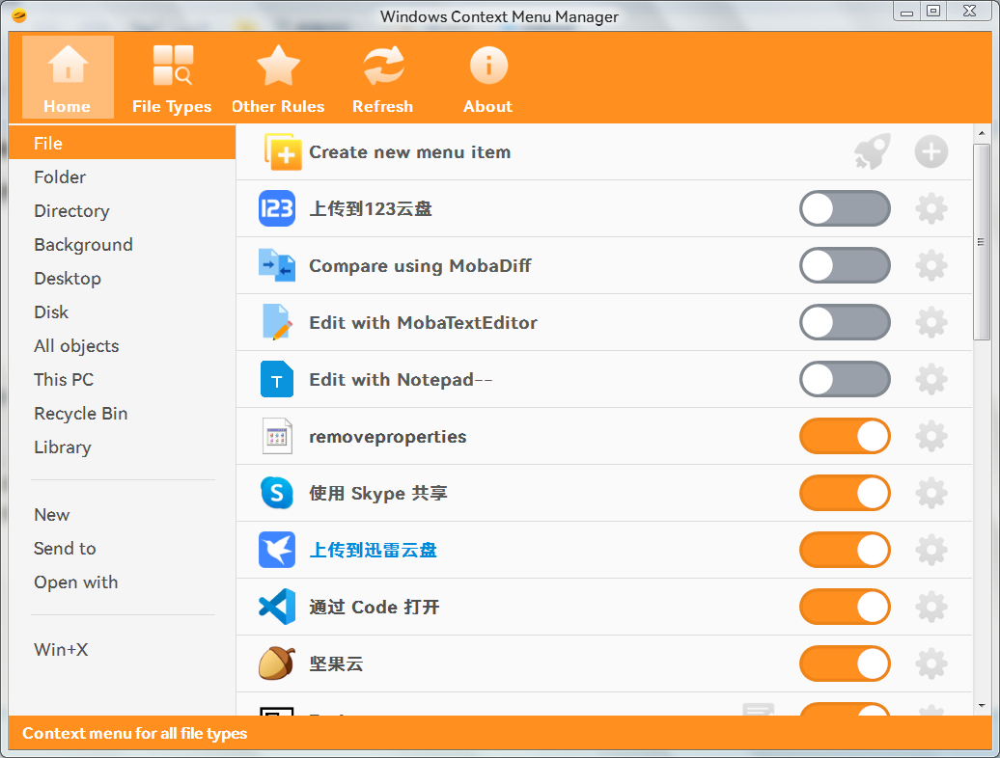
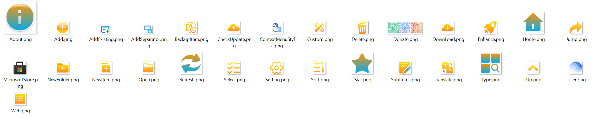

**[简体中文](README.md)** | **English**

# ContextMenuManager

------
> 🖱️ A program to manage the Windows right-click context menu with support of Windows 7 - 11.

## Thanks
* This project is based on [https://github.com/BluePointLilac/ContextMenuManager](https://github.com/BluePointLilac/ContextMenuManager), thanks to [蓝点lilac](https://github.com/BluePointLilac)!
* Thanks to [蓝芸柒](https://github.com/LanYunSeven) for new icons!

## Download software
* [Latest Version][Latest] 
  [Github Releases][GitHub Releases] 
  [Gitee Releases][Gitee Releases] 
* Note: Download the zip file (recommended) or the exe file in the Assets list
* About .NET versions: This application is based on the the .Net 4.8, and it is compatible with Windows 7, 8, 8.1, 10, 11. 
 Win8, 8.1, 10, 11 come with .NET 4.8. Vista and Win7 does not come with .NET 4.8.   You may need to install the appropriate [.NET Framework Runtime Library][.NET Framework Runtime Library].

## Key features
* Enable and disable context menu options for files, folders, submenus (e.g. open, send to), Internet Explorer, and Win+X, etc., and backup and restore right-click menus
* Modify menu names and icons
* Delete context menu entries
* Navigate menus in the registry or File Explorer
* Add custom menu items and commands

## Supported systems and features
* Windows 7, 8, 8.1, 10, 11
* 32 and 64 bit operating systems
* Support for display scaling, optimal at 150% DPI
* Localization support: contributions are welcome

## Screenshots

## Resources

## Notices
* The program needs to read, write and delete a lot of registry entries and files, these behaviours are sensitive and may be mistakenly reported as viruses by Windows Defender, etc. If this happens, please add it to the whitelist by yourself.

* Some special menu items (Shell extensions, file encryption, etc.) may not be displayed in the context menu, but will still show as enabled within the program; this is normal.

* Different context menu manager programs may use different methods for disabling menu options. Using multiple managers at the same time is not recommended.

* While other programs may use destructive methods, this program utilizes the registry keys provided by the system to hide menu items when possible.

* If you have used other context menu managers in the past, use that program to restore the menu items before using this one in order to avoid any potential issues.

* This program is not designed to perform clean uninstalls; however, it can help you find the registry and file locations of menu items so that they can be modified. If you are not familiar with such operations, it is recommended you use the enable/disable functions only.

  [Latest]: https://github.com/Jack251970/ContextMenuManager/releases/latest
  [GitHub Releases]: https://github.com/Jack251970/ContextMenuManager/releases
  [Gitee Releases]: https://gitee.com/Jack251970/ContextMenuManager/releases
  [.NET Framework Runtime Library]: https://dotnet.microsoft.com/download/dotnet-framework