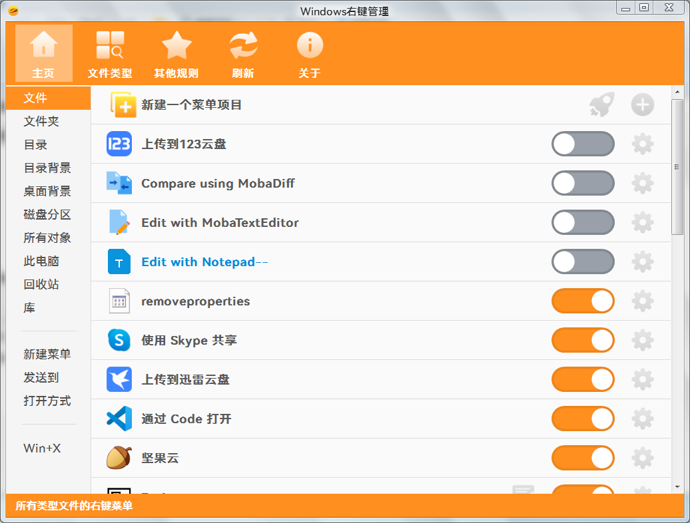

**简体中文** | **[English](README-en.md)**

    </img>

<h1 align="center">ContextMenuManager</h1>
<h4 align="center">一个纯粹的Windows右键菜单管理器，支持 Windows 7 ~ 11。</h4>

---

## 💕 特别感谢
* 本项目基于 [https://github.com/BluePointLilac/ContextMenuManager](https://github.com/BluePointLilac/ContextMenuManager) 进行开发，感谢作者 [蓝点lilac](https://github.com/BluePointLilac)！
* 感谢由 [蓝芸柒](https://github.com/LanYunSeven) 制作的的新图标！
* 感谢由 [澜芸](https://github.com/LanYun2022) 制作的的新图标！

## 🚀 程序下载
* [最新版本][Latest] 
  [GitHub Releases][GitHub Releases] 
  [Gitee Releases][Gitee Releases] 
* 下载说明：在Assets文件列表里面下载zip（建议）或者直接下载exe
* .NET版本说明：程序基于.NET4.8，适用于Win11、10、8.1、8、7 
  Win8、8.1、10、11自带.NET4.8，win7不自带.NET4.8 
  自带.NET可直接运行程序，不自带则需要安装对应版本的[.NET Framework运行库]

## ⭐ 主要功能
* 启用或禁用文件、文件夹、新建、发送到、打开方式、自定义文件格式、IE浏览器、WinX等右键菜单项目并对右键菜单进行备份和恢复
* 对上述场景右键菜单项目进行修改名称、修改图标、导航注册表位置、导航文件位置、永久删除等操作
* 对上述场景右键菜单自定义添加项目，自定义菜单命令

## 🖥️ 兼容性
* 适用于 Windows 7、8、8.1、10、11
* 适用于 64位、32位 的系统
* 适用于高分屏，最佳显示缩放比为150%
* 程序支持国际化多语言显示，欢迎为此程序制作语言字典

## 🖼️ 运行截图
<picture>
  <source media="(prefers-color-scheme: dark)" srcset="./Screenshot/Screenshot-dark.png">
  <source media="(prefers-color-scheme: light)" srcset="./Screenshot/Screenshot.png">
  
</picture>

## 🔣 资源引用
<picture>
  <source media="(prefers-color-scheme: dark)" srcset="./Screenshot/AppImage-dark.png">
  <source media="(prefers-color-scheme: light)" srcset="./Screenshot/AppImage.png">
  
</picture>

## 🪧 温馨提示
* 程序需要对大量的注册表项和文件进行读写删改操作，这些行为比较敏感，可能会被 Windows Defender 等误报为病毒，如发生此情况请自行添加进白名单。

* 一些特殊菜单项（Shell 扩展、加密文件等）可能会受到其他因素影响导致不会直接显示在右键菜单中，但是按照程序使用的通用规则在此程序中仍会显示为启用，这是正常的现象。

* 每个右键管理程序禁用菜单方法可能不同，建议不要同时使用多个右键菜单管理程序。

* 大部分程序使用简单暴力的备份删除法，此程序尽可能使用了系统提供的键值进行隐藏以便于之后的恢复。

* 通过其他程序禁用的菜单项目。请先使用对应程序还原，不然可能无法在此程序中看到它。

* 此程序不用于清理未卸载干净的程序，但是可以帮助你快速定位菜单项相关注册表位置和文件位置，你可以根据相关内容进行你的操作。如果你是一个电脑小白，建议只使用启用/禁用功能。

## 🏆 贡献者
感谢我们的贡献者们！

由 [contrib.rocks](https://contrib.rocks) 生成。

  [Latest]: https://github.com/Jack251970/ContextMenuManager/releases/latest
  [GitHub Releases]: https://github.com/Jack251970/ContextMenuManager/releases
  [Gitee Releases]: https://gitee.com/Jack251970/ContextMenuManager/releases
  [.NET Framework运行库]: https://dotnet.microsoft.com/zh-cn/download/dotnet-framework/net48

## ❤️ 感谢

要是你觉得这插件好用，就请我喝杯咖啡支持一下吧！

